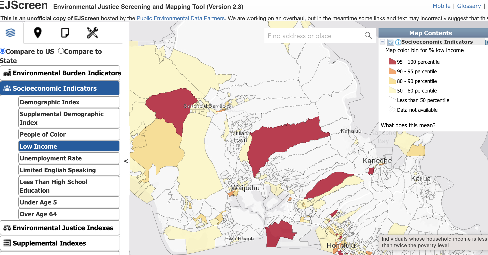
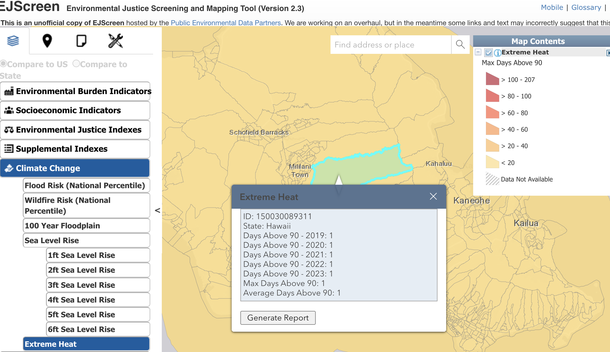
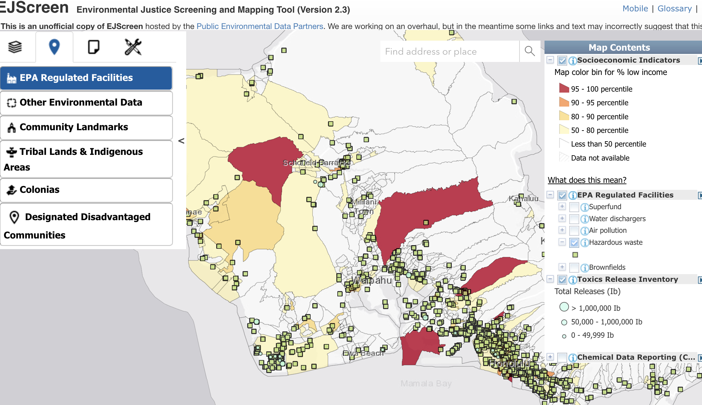
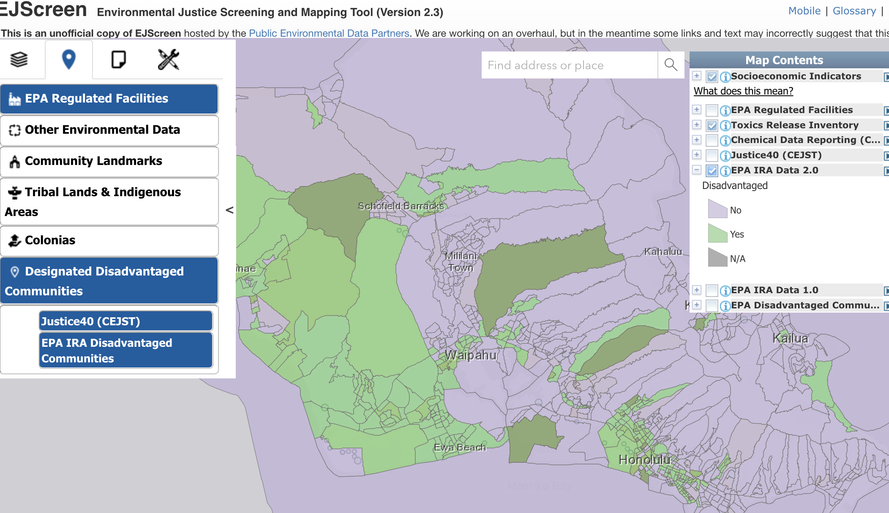
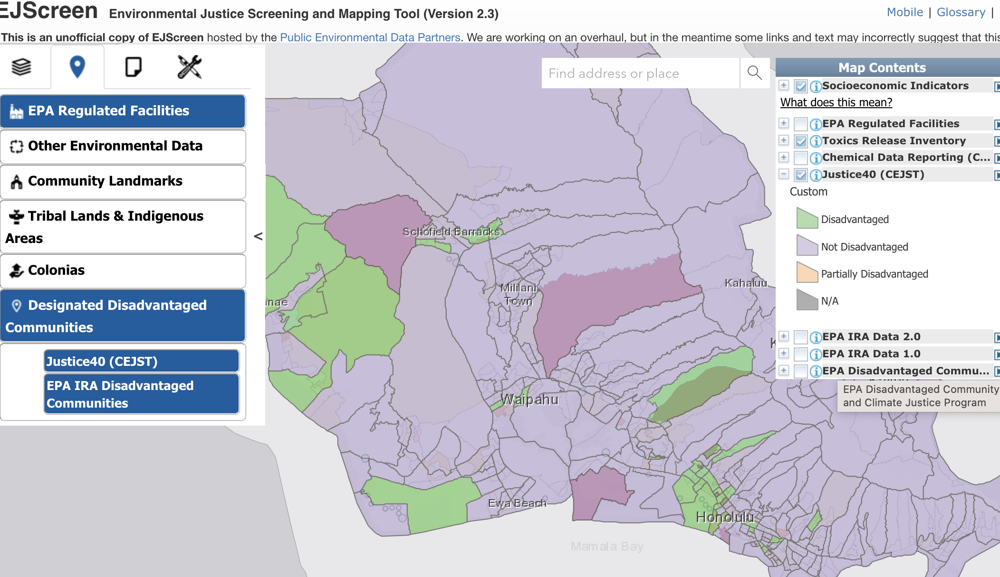
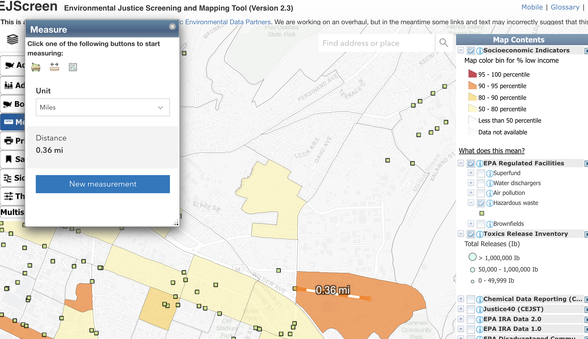

# USSEE
## Materials for USSEE Workshop on Teaching Ecological Economics

Bio: 
I am an environmental economist very passionate about integrating the benefits of functioning ecosystems into policy decisions to support effective conservation efforts. I am currently an Assistant Professor at University of Hawaiʻi at Mānoa in the Department of Natural Resources and Environmental Management focusing on Hawaiʻi’s ecosystems and communities. I am active on social media platforms such as TikTok & Instagram @iguanalow. I strongly believe if we are not communicating our science/research on online platforms, the social conversation is happening without us. 

Workshop:
My workshop will focus on how I teach quantifying environmental justice (EJ). I will explore the historical context of the EJ movement that spawned research into the relationship of pollution and social economic indicators. We will then dive into the importance of understanding what is being measured and what the number means. I will show how EJ requires moving beyond neoclassical economic assumptions of what is occurring at the margins. Lastly, we will interactively discuss on how researchers are adapting to the current political climate, including navigating alternative data repositories as federal environmental data becomes less accessible. Slides, materials and notes will be posted for workshop at https://github.com/loweas/ussee.

## Case Study Mini‑Lab
Small‑group/individual task: interpret an EJScreen output tile for a real neighborhood.

1. Find your home (childhood or current)

2.  Add a Map Social Indicators : Low Income, People of Color, or Education

3. Climate Change: Extreme Heat click on census tract to explore how many days have been over 90 across years.

4. Navigate to Places add EPA Regulated Facilities, Explore Regulated Facilitates, Add Toxic Release

6. Designated Disadvantage Communities (Justice40 & EPA IRA)

   
7. Using Tools ( Measure, click Ruler) calculate distance to an EPA Regulated Facilities or TRI 

## Reflection Questions

1. Does your local knowledge reflect the data shown?

2. Did Justice40 or EPA EJ Screen Identify areas make sense with your local knowledge? (notice different scale for these two files)

3. How close was measurement to home or current residents?

4. Has the number of days above 90 grown in your area?
